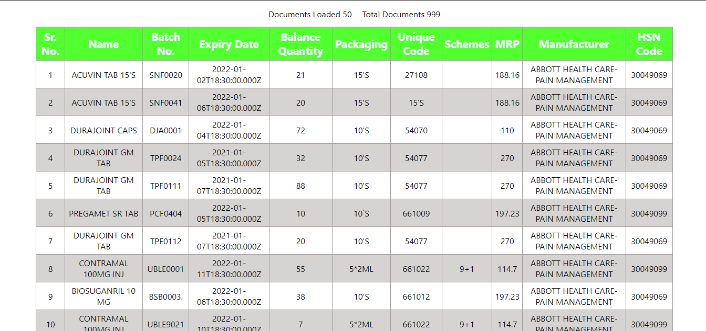

# MargHealth Technical Assessment

## Aim

- This project was technical assessment for part time job at MargHealth. Problem statement was to create a full stack application with backend api that read csv file and upload data to mongodb, and get all data which will be consumed by frontend and displayed in form of table.

## General Info

- Backend API
  - /uploadCSV: reads that data from a csv file with hardcoded file path and saves the data in mongodb.
  - /data/getAll: returns data from mongodb with limit of 50 at a time. Add query skip to access full data by skipping previous obtained data.
- Frontend:
  - Single page which displays table with 50 rows, total loaded document count and total available data count. It have infinite scroll feature which loads more data as you scroll to the bottom.

## Technologies And Support

- [Mongodb](https://www.mongodb.com/3) as Database.
- [Express](https://expressjs.com/) as Backend Library.
- [Next](https://nextjs.org/) as Frontend Framework.
- [React](https://reactjs.org/) as Frontend Library.
- [Node](https://nodejs.dev/) for JavaScript runtime environment along with [npm](https://www.npmjs.com/).
-

## Screenshots

- 

## Installation

- Method 1:
  
> Go to this page  
> Click on the green Code button and download zip. 
> Unzip the folder and open the index.html file in the browser and you will see the output.

- Method 2:

> Follow this steps only if you have git installed on your machine. 
> Open a terminal and write this
> git clone https://github.com/VAJRESH/MargHealth-Technical-Assesment.git

This will download the file in a folder.
Navigate to the folder and open terminal in that folder and type to install dependencies

> cd backend  
> npm install 

And start the server 

> npm start

Move back from terminal
> cd ..

or open a new terminal in parent folder

Install dependencies

> cd frontend  
> npm install 

And start the server 

> npm run dev
